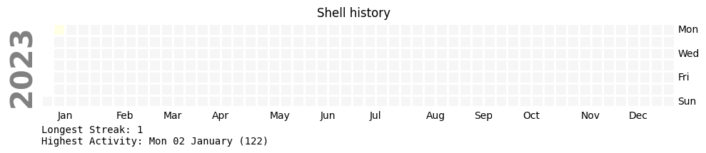

# atuin-graph
activity graph for [atuin](https://atuin.sh) self hosted sync server



Both scripts use the same code from `generate_calendar.py`  
It connects to the PostgreSQL atuin database, using by default the `db_uri` setting from atuin `server.toml` config file

Required Python version: >= 3.11 (uses the [tomllib parser](https://docs.python.org/3/library/tomllib.html))

## standalone
***- `atuin-graph.py`***: standalone script, takes a username as input and creates a `user.png` file

The `-until` parameters allows to query up to a max date, this is useful to create one png per day and create a gif with `imagemagick` for example (`convert -delay 10 -loop 1 *.png atuin.gif`)

```bash
usage: atuin_graph.py [-h] --user USER [--until UNTIL]
                      [--atuin_server_config ATUIN_SERVER_CONFIG]
```
##  web app
***- `web.py`***: `Flask`app which dynamically serves a png for a given user and optional date
```bash
https://my-atuin-server/graph/username[/yyyy-mm-dd]
```

one way to run it:

```bash
GUNICORN_CMD_ARGS="--bind=127.0.0.1:8889" SCRIPT_NAME=/graph gunicorn web:app
```

and on nginx side

	location /graph {
	
                proxy_bind              $server_addr;
                proxy_pass              http://127.0.0.1:8889;
        }


